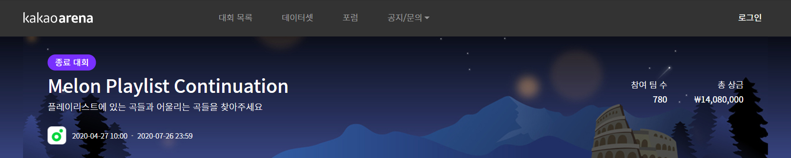

# Kakao Arena Melon Playlist Dataset

> DISCLAIMER:
>
> 전 이 데이터의 라이센스를 보유하고 있지 않습니다. I do not own the original dataset and do not claim to hold the license to the data. 해당 데이터에 대한 저작권은 저에게 있지 않다는 점을 미리 밝힙니다. No copyright infringement intended.

<br>

## 소개 Introduction

**카카오 아레나 멜론 플레이리스트 데이터셋**은 2020년 4월부터 2020년 7월까지 열렸던 [카카오 아레나 제3회 멜론 플레이리스트 지속화 경진대회](https://arena.kakao.com/c/7)에서 공개된 데이터셋입니다. **Kakao Arena Melon Playlist Dataset** is a dataset opened to the public with the start of Kakao Arena's 3rd competition, the [Melon Playlist Continuation competition](https://arena.kakao.com/c/7) held from Apr. 2020 to Jul. 2020. 



해당 대회는 현재까지도 플레이그라운드의 형식으로 오픈되어 있으며 ([플레이그라운드 링크](https://arena.kakao.com/c/8)), 데이터 또한 공개가 되어 있습니다. The competition is still open for competitors ([Playground Link](https://arena.kakao.com/c/8)), and the dataset is also available to the community to practice with.

카카오 아레나 측은 해당 데이터셋을 두 가지 상황 하 사용할 수 있도록 허락하고 있습니다. Kakao Arena is opening the dataset under the following two circumstances.

* 카카오 아레나의 'Melon Playlist Continuation' 대회 참가 목적 In the case of joining Kakao Arena's 'Melon Playlist Continuation' competition
* ***카카오 아레나를 인용할 경우 학술 목적으로 이용 가능 In the case of academic usage with Kakao Arena cited***

카카오 아레나의 멜론 플레이리스트 데이터셋은 현재 국내외에서 제공되고 있는 음악 데이터셋들 중 가장 방대한 양의 데이터 양을 제공하고 있으며, 특히 음악 정보 검색 분야와 추천 분야에서의 학술적 사용가치가 매우 높습니다. Kakao Arena Melon Playlist Dataset is currently providing the largest amount of data comparing to any other music dataset both (Korean) domestic and worldwide and is very valuable to academic areas such as Music Information Retrieval(MIR) and Recommendation Systems.

이 레포지토리에서는 카카오 아레나의 대회 전체를 소개하기 보다는, 데이터셋을 집중적으로 설명 및 소개하고 관련된 추가 데이터를 제공하는 것을 목표로 두고 있습니다. I plan not to explain about the competition any further, but to share information about the dataset itself and provide a little extra relevant data of my own.

대회에 관심이 있으신 분들은 [플레이그라운드 링크](https://arena.kakao.com/c/8) 및 [대회 공식 베이스라인 코드](https://github.com/kakao-arena/melon-playlist-continuation)를 참고해주시길 바랍니다. For those who are interested in the competition, check out this [Playground Link](https://arena.kakao.com/c/8) and [the official baseline code for](https://github.com/kakao-arena/melon-playlist-continuation)

<br>

## 데이터 Data

* **데이터셋 링크 Link to Dataset: https://arena.kakao.com/c/8/data**

카카오 아레나 사이트에 로그인 및 이용약관 동의 하에 다음과 같은 구성의 데이터셋을 사용할 수 있습니다. With a simple login to Kakao Arena portal and agreement to the terms of use, you can gain access to the following dataset.

데이터셋에서 제공하는 정보는 [멜론](https://www.melon.com/) 서비스에서 수집된 플레이리스트의 일부분입니다. The dataset is a part of the data serviced by [Melon](https://www.melon.com/), the largest music streaming service in Korea.

### 곡 메타데이터 Song Metadata

- `song_meta.json`
  - 총 707,989개의 곡에 대한 메타데이터 metadata of 707,989 songs
  - 필드 설명 JSON file field explanation
    - _id: **(대회용)** 곡 ID song ID **(used for competition)**
    - album_id: 앨범 ID album ID
      - 실제 서비스 되고 있는 앨범 url ID와 일치 the same album ID used in Melon service
    - artist_id_basket: 아티스트 ID 리스트 artist ID list
    - artist_name_basket: 아티스트 리스트 artist name list
    - song_name: 곡 제목 song name
    - song_gn_gnr_basket: 곡 장르 리스트 song genre list
    - song_gn_dtl_gnr_basket: 곡 세부 장르 리스트 song subgenre list
    - issue_date: 발매일 released date
  - 카카오 아레나 측은 해당 메타데이터의 모든 정보가 저작권자의 비공개 여부 전환, 곡 삭제, 메타데이터 수정 등으로 유효하지 않거나 변동될 수 있다고 밝히고 있습니다. Kakao Arena warns that the metadata provided could differ or be false due to music copyright holders' request or change of metadata.
- `genre_gn_all.json`
  - 곡 메타데이터에 수록된 장르에 대한 정보 information of genre/subgenre tags used

### 플레이리스트 데이터 Playlist Data

- 카카오 아레나는 총 148,826개의 플레이리스트에 대한 데이터를 총 3가지 서브셋으로 나누어서 제공하고 있습니다. Kakao Areana provides data of 148,826 playlists, seperated into three subsets.
- `train.json`
  - 대회 모델 학습용 파일 train data for competition
  - 115,071개 플레이리스트의 원본 데이터 full information of 115,071 playlists
  - 필드 설명
    - id: 플레이리스트 ID playlist ID
    - plylst_title: 플레이리스트 제목 playlist name
    - tags: 태그 리스트 tag list
    - songs: 곡 리스트 song list
    - like_cnt: 좋아요 개수 like count
    - updt_date: 수정 날짜 updated date
- `val.json`
  - 대회 공개 리더보드용 문제 파일 validation data used to rank competitors (public leaderboard)
  - 23,015개 플레이리스트의 일부 곡, 태그만 수록된 데이터 23,015 playlists with parts of information masked
  - 필드 설명 JSON file field explanation
    - id: 플레이리스트 ID playlist ID
    - plylst_title: 플레이리스트 제목 playlist name
    - tags: 태그 리스트 tag list
    - songs: 곡 리스트 song list
    - like_cnt: 좋아요 개수 like count
    - updt_date: 수정 날짜 updated date
- `test.json`
  - 파이널 리더보드용 문제 파일 test data used to rank competitors (private final leaderboard)
  - 10,740개 플레이리스트의 일부 곡, 태그만 수록된 데이터 10,740 playlists with parts of information masked
  - 필드 설명 JSON file field explanation
    - id: 플레이리스트 ID playlist ID
    - plylst_title: 플레이리스트 제목 playlist name
    - tags: 태그 리스트 tag list
    - songs: 곡 리스트 song list
    - like_cnt: 좋아요 개수 like count
    - updt_date: 수정 날짜 updated date

### 멜스펙토그램 데이터 Mel-spectrogram Data

- `arena_mel_{0~39}.tar`

  - 총 707,989개의 곡에 대한 멜스펙토그램 데이터 mel-spectrogram of 707,989 songs

    - **(대회용)** 곡 ID는 0~707988 까지 배정 song labeled with **(competition)** song ID from 0 to 707988

    - 각 파일은 `곡ID.npy` 의 파일 이름을 가지고 있습니다. 파일의 갯수가 많기 때문에, 각 npy 파일은 각각 `{floor(ID / 1000)}/` 폴더 아래에 들어가있습니다. 예를 들어 곡 ID가 415263인 파일의 경우 `415/415263.npy` 로, 곡 ID가 53712인 경우 `53/53712.npy` 에 존재합니다. Each mel-spectrogram file is named as `songID.npy`. Due to the large number of files, each npy files are under folder named `{floor(ID / 1000)}/`. For example, song with an ID of 415263 is located at `415/415263.npy`, and song with and ID of 53712 is located at `53/53712.npy`.

    - 각 곡은 numpy로 다음과 같이 로드할 수 있습니다. Each song can be loaded with numpy library as following.

      ```python
      import numpy as np
      mel = np.load("0.npy")
      ```

    - 각 곡의 멜스펙토그램 데이터는 각 곡의 20초에서 50초를 이용하여 제작되었으며, 각 멜스펙토그램의 shape은 (48, 1876) 입니다. (출처: [대회 공식 QnA](https://arena.kakao.com/forum/topics/287)) Each mel-spectrogram data is generated with each song's clip from 0:20 to 0:50, and the shape of mel-spectrograms is (48, 1876). (rf. [QnA from official competition site](https://arena.kakao.com/forum/topics/287))

    - 멜스펙토그램 데이터는 [Essentia](https://essentia.upf.edu/)로 제작되었으며 파라미터는 다음과 같습니다. (출처: [대회 공식 QnA](https://arena.kakao.com/forum/topics/214)) Mel-spectrogram is generated with [Essentia](https://essentia.upf.edu/) library and the used parameters are as following. (rf. [QnA from official competition site](https://arena.kakao.com/forum/topics/214))

      ```python
      numbands=48
      sampleRate=16000
      frameSize=512
      hopSize=256
      window='hann'
      weighting='linear'
      warpingFormula='slaneyMel'
      normalize='unit_tri'
      ```

<br>

※ 해당 데이터와 관련하여 학술 목적으로 가사 및 앨범아트를 사용하고자 하면 멜론에서 실제 서비스 되는 노래 ID가 필요합니다. 이 레포지토리에서는 실제 서비스 되는 노래 ID 데이터를 제공하고자 합니다. To use these data with additional lyrics data and album art image data for an academic use, we need the actual song ID used in Melon service. I plan to provide the real song ID corresponding to each songs in the data.

### 추가 데이터 Additional Data

* ipsum lorem

<br>

<br>

## 타 데이터셋과의 비교 Comparison with Other Datasets

| Name                        | Year | Song Length    | Genre Classes | # of Songs               | Provided form                   |
| --------------------------- | ---- | -------------- | ------------- | ------------------------ | ------------------------------- |
| GTZAN                       | 2002 | 30 sec.        | 10            | 1,000                    | raw audio                       |
| Extended<br />Ballroom      | 2016 | 30 sec.        | 9             | 4,000                    | raw audio                       |
| Greek<br />MusicDataset     | 2015 | 30 sec.        | 8             | 1,400                    | raw audio                       |
| FMA                         | 2017 | 30 sec. / full | 8 ~ 161       | 8,000<br />~ 106,574     | raw audio, <br />features       |
| MTG<br />-Jamendo           | 2019 | 30 sec.        | 95            | 55,215<br />(genre task) | raw audio,<br />mel-spectrogram |
| **KakaoArena<br />Dataset** | 2020 | 30 sec.        | 30 / sub 224  | **707,989**              | mel-spectrogram                 |

<br>

## 코드 Code


각 파이썬 스크립트 파일, 노트북 파일, 모듈들에 대한 설명입니다. This is explanation for The following notebooks, scripts, and modules have been developed for the dataset.

1. [`ipsum.ipynb`](#): ipsum lorem
2. [`lorem.py`](#): ipsum lorem

<br>

